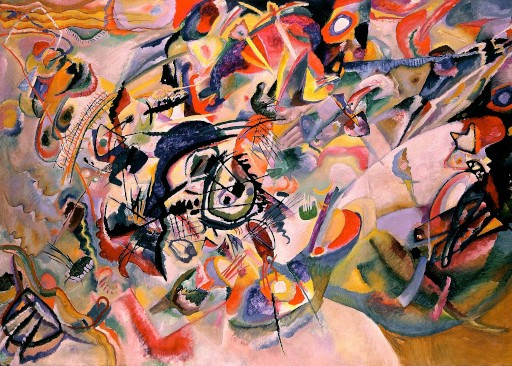

# PRiR zadania lab 12
##Obrazy wejściowe:<br>

<br><br>
##Wyniki ze względu na ilość iteracji <br>
100: <br>.png)<br>
700: <br>.png)<br>
1500: <br>.png)<br>
4000: <br>.png)<br>

##Wpływ wyboru warstw:
Podstawowe: (obrazy wyżej)
```
style_layer_names = [
    "block1_conv1",
    "block2_conv1",
    "block3_conv1",
    "block4_conv1",
    "block5_conv1",
]
```

Zmienione: (obrazy poniżej)
```
style_layer_names = [
    "block1_conv1",
    "block2_conv1",
    "block3_conv1",
]
```
100: <br>.png)<br>
700: <br>.png)<br>
1500: <br>.png)<br>

##Źródła
https://keras.io/examples/generative/neural_style_transfer/
